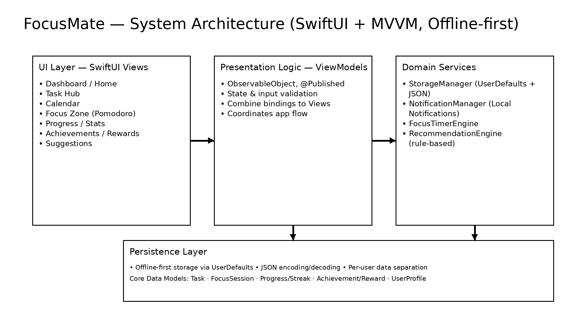
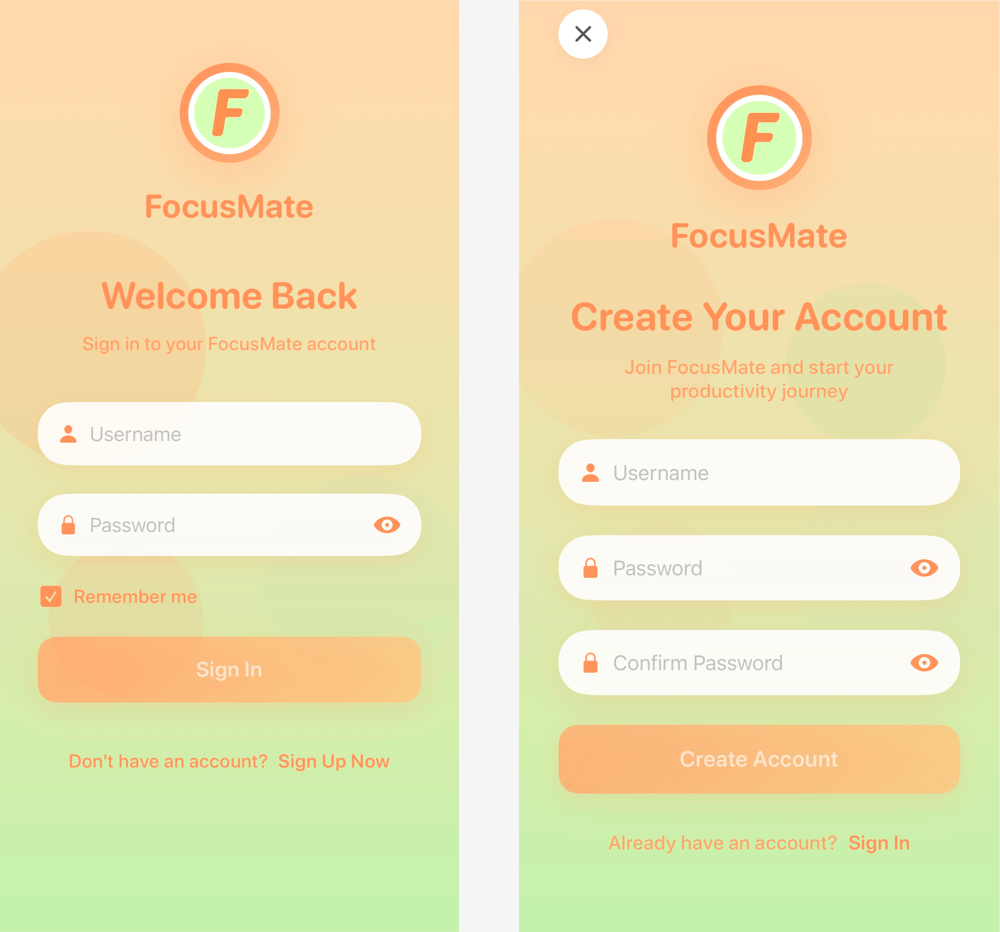
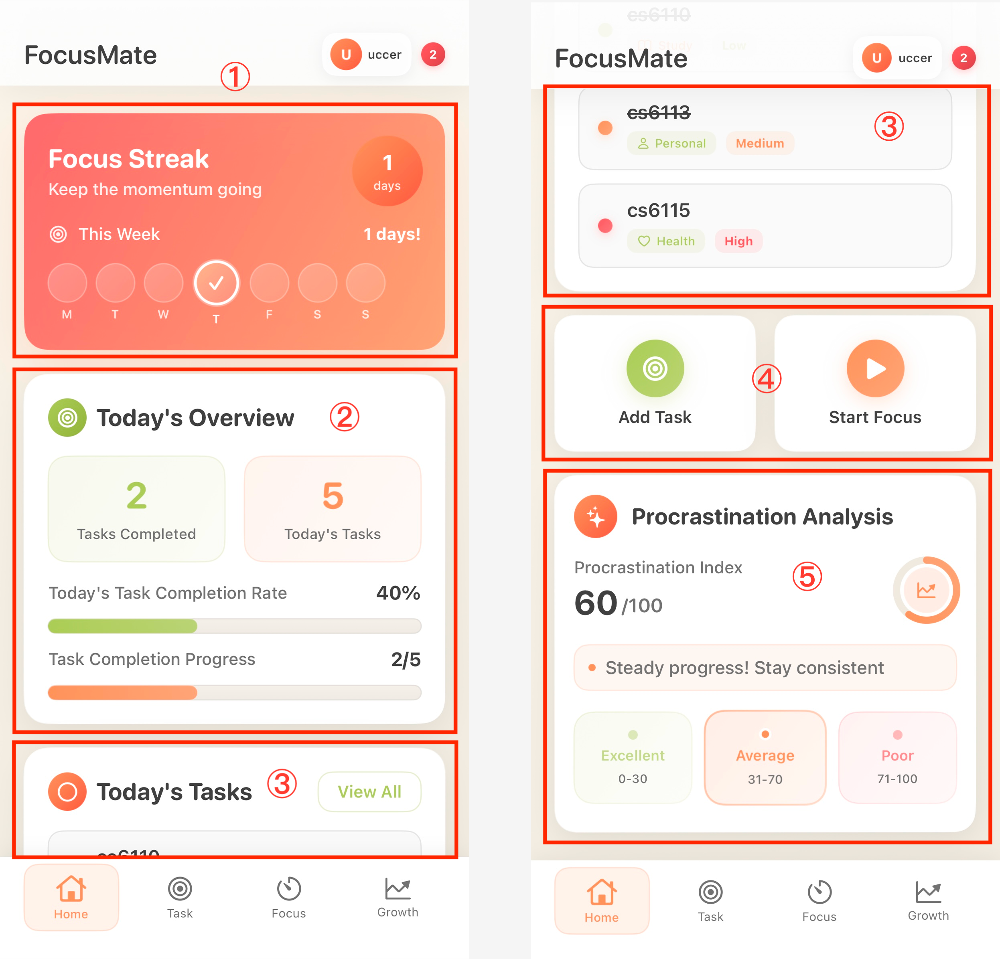
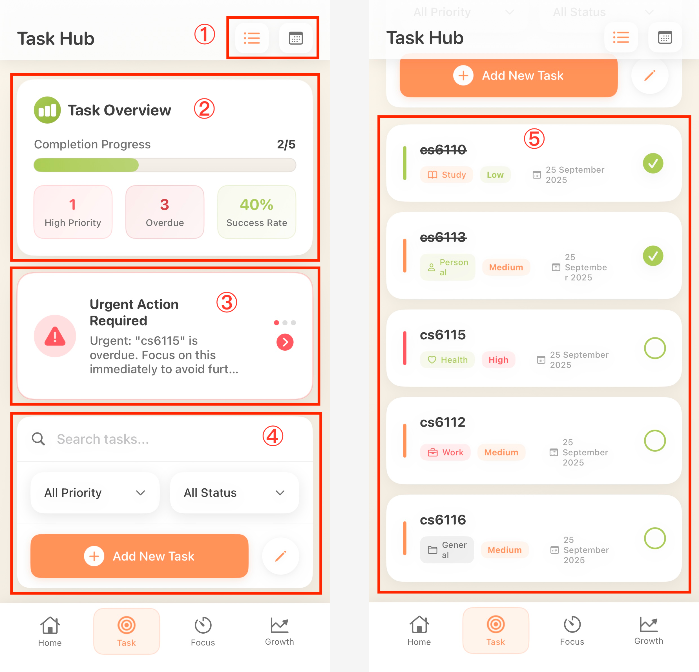
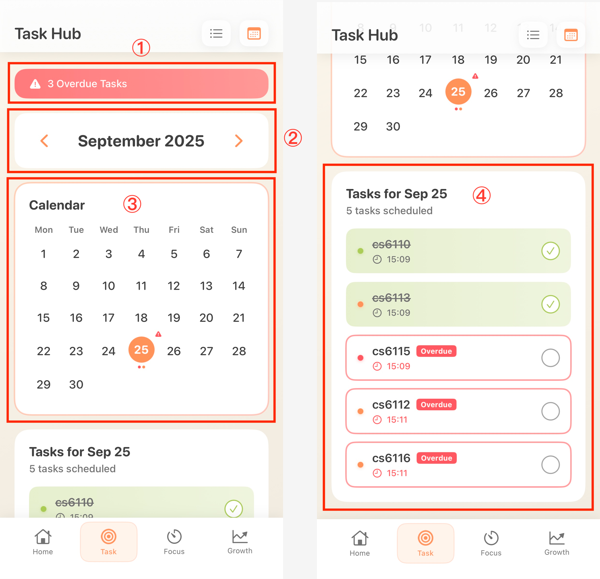
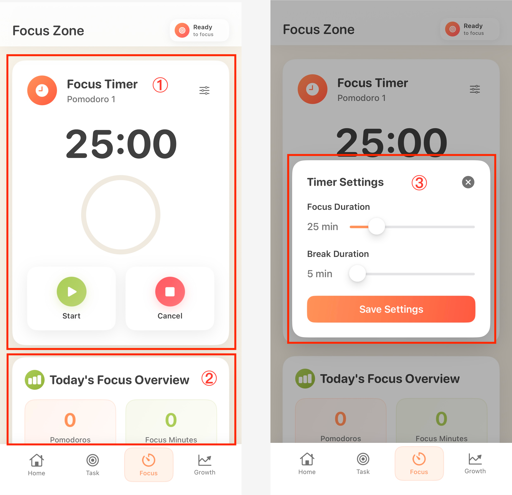
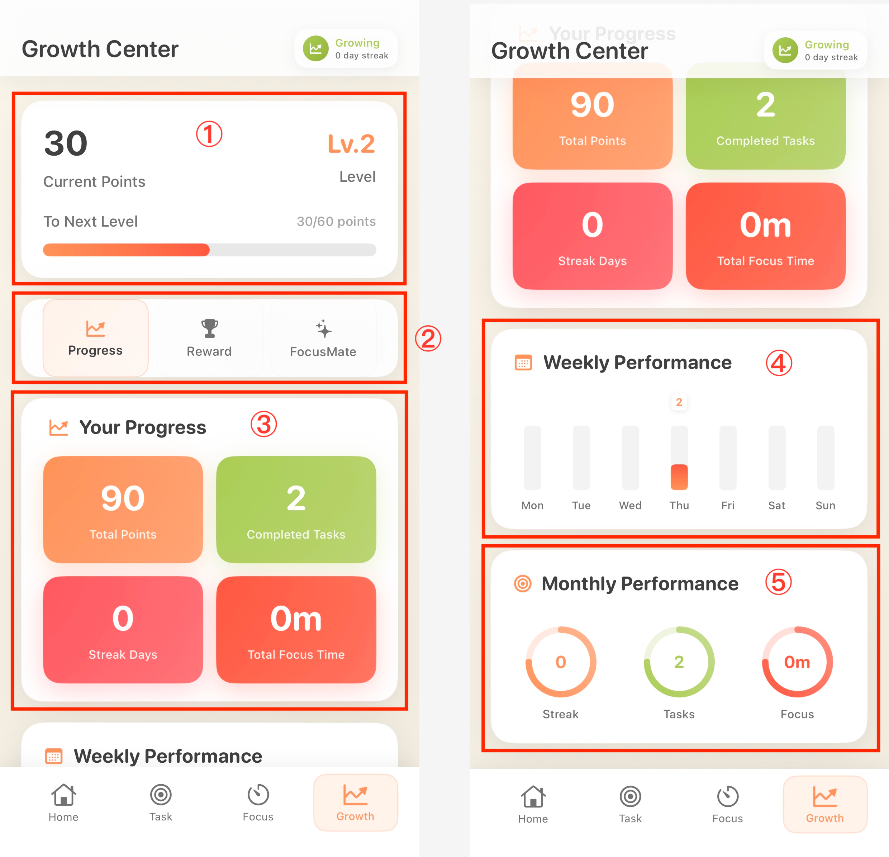
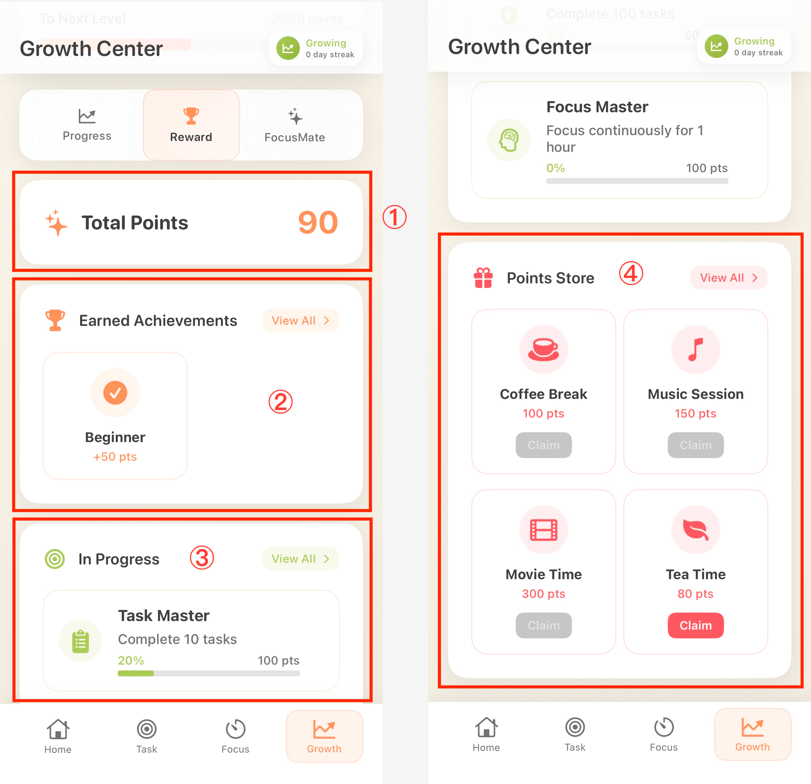
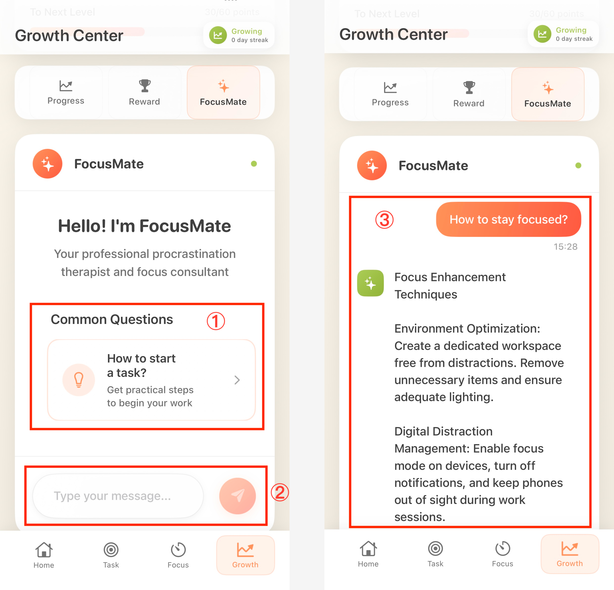

# FocusMate (Showcase) — Mobile App for Reducing Student Procrastination

**FocusMate** is a student-focused mobile productivity application designed to support **task planning**, **sustained focus**, and **reduced procrastination**.  
This repository is a **showcase version** prepared for academic review (PhD applications / research portfolio).

---

## Research Context
- **Area:** Human–Computer Interaction (HCI), Digital Wellbeing, Behavior Change
- **Topic focus:** Student procrastination and self-regulation support through mobile intervention design
- **Goal:** Translate evidence-informed design into a functional mobile intervention and evaluate it using standard UX measures

---

## Key Features
- Task management (priority, categories, reminders)
- Calendar-based planning and scheduling
- Pomodoro focus sessions (customisable timers)
- Progress tracking (streaks and statistics)
- Achievements & rewards (lightweight gamification)
- Structured productivity suggestions (rule-based recommendations)

---

## Evaluation (Pilot Study)
- **Participants:** N = 8 university students
- **Instruments:** UEQ-S · SUS · NASA-TLX
- **Summary results:**
  - UEQ-S overall: **1.17 ("Good")**
  - SUS mean: **60.3**
  - NASA-TLX overall workload: **3.85 (moderate)**

> Note: This study served as an initial pilot evaluation. Future work includes longer-term and longitudinal assessment.

---

## Architecture (MVVM)

---

## Screenshots

| Authentication | Home | Task Hub |
|---|---|---|
|  |  |  |

| Calendar | Focus Zone | Growth / Progress |
|---|---|---|
|  |  |  |

| Rewards | Suggestions |
|---|---|
|  |  |

---

## Tech Stack
- **Swift / SwiftUI (iOS)**
- Architecture: **MVVM**
- Offline-first persistence: **UserDefaults + JSON encoding**
- Local notifications: **UNUserNotificationCenter**

---

## Notes
- This repository intentionally excludes any sensitive configuration and does not necessarily contain the full production codebase.
- Full implementation can be shared **upon request** for academic evaluation.

---

## Contact
**Guanheng Wang**  
Email: wgh357004@gmail.com  
LinkedIn: https://linkedin.com/in/guanheng-wang-427320354  
Portfolio: https://dylan3570.github.io/GuanhengWang-Portfolio
